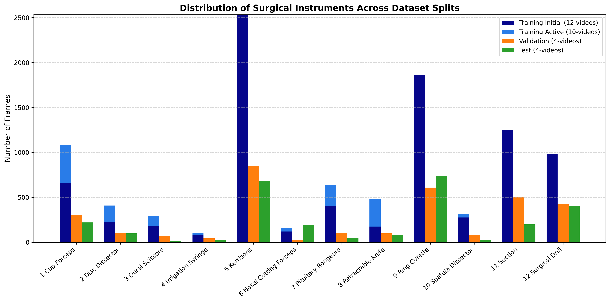

# Summary
The purpose of this repo is to develop models for instrument classification, segmentation, and tracking during the sella phase of endoscopic pituitary surgery, for the purposes of predicting OSATS (Objective Structured Assessment of Technical Skills).

# Research
- The code in this repository is written by Adrito Das, a Honorary Research Fellow of University College London (UCL) at the UCL Hawkes Institute: https://www.ucl.ac.uk/hawkes-institute.
- The associated paper is not yet published, but will be linked here once available.
- For related work see: https://scholar.google.com/citations?user=F1w5uDkAAAAJ&hl=en&authuser=1
- For personal details see: https://sites.google.com/view/adrito-das
- If you spot anything wrong, or have any queries, please email: adrito(dot)das(dot)20(at)ucl(dot)ac(dot)uk

# Docker
- A docker is provided to run the entire pipeline, to predict OSATS for a given video using the trained models (see docker/ for more details).
- Models in .onnx format can download from: https://huggingface.co/drdreets/PitInst
- An example video input and video output is given within the docker

# License
This project is dual-licensed under both the MIT License and the Apache License (Version 2.0). You may choose which license you want to use the software under. See LICENSE.md for details on this and licenses of software used in this repositry.

# Data
- All video data was collected from the National Hospital for Neurology and Neurosurgery, London, WC1N 3BG. Across the 40 videos, the mean length is 23mins36secs (median 20mins54secs, IQR 17mins7secs-28mins7secs).
- Instrument annotations were performed by medical trainees and surgical trainees, with verficiation from surgical consultants. This was done using the commercially available Encord annotation software (https://app.encord.com/). A distribution of the instrument annotations can be seen below, note this is for a 12-class instrument task and only 30/40 videos were segmented. The data was split as follows: 4-test videos (annotated at 1fps), 4-val videos (annotated at 1fps), 12-training videos (annotated at 1fps), 10-active-training videos (annotated for low volume instruments at 1fps).
- OSATS annotations were performed by surgical consultants. Across the 40 videos, the mean value is 18.6 (median 18.0, IQR 16.0-20.5).
- The data used for this project is not currently publically available, although the plan is to release it in the coming months. Similar publically available data: https://doi.org/10.5522/04/26511049 (PitInst-2023, 4-class instrument segmentation); https://doi.org/10.5522/04/26531686 (PitVis-2023, instrument & surgical step classification) https://huggingface.co/datasets/drdreets/PitVis-2023 (PitVis-2023 alt download).


# Results & Ablations
| Ablation | Split | Macro F1-score | Macro Precision | Macro Recall | Binary F1-score |
| :---: | :---: | :---: | :---: | :---: | :---: |
| Baseline | Val | 63.7 | 62.4 | 66.5 | 93.3 |
| | Test | 63.5 | 64.9 | 69.9 | **95.0** |
| ⊕ FlexMatch | Val | 56.6 | 58.0 | 63.7 | 91.2 |
| | Test | 53.9 | 57.8 | 64.1 | 92.3 |
| ⊕ LSTM {5} | Val | 44.2 | 60.1 | 41.0 | 85.3 |
| | Test | 39.8 | 51.1 | 37.7 | 85.2 |
| ⊕ Online smoothing {5} | Val | 62.7 | 65.2 | 61.3 | 85.1 |
| | Test | 57.4 | 63.3 | 59.1 | 85.2 |
| ⊕ Offline smoothing {5} | Val | **68.9** | **73.8** | **67.9** | **92.5** |
| | Test | **67.4** | **75.3** | **69.4** | 94.6 |

> **Classification performance across different variations of the best model, DINOv2, given as percentages (%).** The ⊕ symbol indicates the model was built on top of the baseline. `{}` indicates the number of frames used as a clip in the temporal architecture. **Bold** indicates the best performing metric of that split.

| Architecture [Backbone] | Details | Split | Macro Dice | Macro F1-Score | Binary Dice |
| :---: | :---: | :---: | :---: | :---: | :---: |
| DeepLabV3+ [ResNet50] | Segmentation & Classification | Val | 59.2 | 51.0 | 94.1 |
| | | Test | 64.9 | 51.7 | 94.6 |
| DeepLabV3+ [ResNet50]<br>DINOv2 | Binary segmentation ⊎<br>Multi-class Classification | Val | 67.8 | 64.7 | 95.0 |
| | | Test | 73.0 | 63.4 | 95.6 |
| Mask2Former [DINOv2] | Segmentation & Classification | Val | 73.5 | 67.0 | **96.4** |
| | | Test | 75.9 | 63.7 | **96.4** |
| Setrmla [DINOv2] | Segmentation & Classification | Val | 72.3 | 64.6 | 95.6 |
| | Test | 74.3 | **66.4** | 95.4 |
| UperHead [DINOv2] | Segmentation & Classification | Val | 70.1 | 63.3 | 95.6 |
| | | Test | 70.1 | 53.9 | 96.1 |
| Mask2Former [DINOv2] ⊕<br>Offline smoothing {7} | Segmentation & Classification | Val | **75.9** | **70.1** | 95.7 |
| | | Test | **76.2** | 64.2 | 95.6 |
| Mask2Former [DINOv2] | Segmentation & Classification ⊞ | Val | 72.6 (+5.6) | 75.9 (+2.4) | **96.6 (+0.2)** |
| | | Test | 73.3 (+9.6) | 78.2 (+2.3) | **96.6 (+0.2)** |
| Mask2Former [DINOv2] ⊕<br>Offline smoothing {7} | Segmentation & Classification ⊞ | Val | **79.5 (+3.6)** | **77.8 (+7.7)** | 96.3 (+0.7) |
| | | Test | **81.0 (+4.8)** | **78.3 (+14.1)** | 96.2 (+0.8) |

> **Segmentation performance across different architectures, given as percentages (%).** & indicates both segmentation and classification calculated by the same model; ⊎ indicates segmentation and classification calculated by separate models; ⊕ indicates the post-processing smoothing; ⊞ indicates active training, `{}` indicates the number of frames used as a clip in the temporal architecture. **Bold** indicates the best performing metric of that split before and after active training. (+) indicates the improvement of performance after active training.

| Model | Split | MAE Total | Respect for Tissue | Time and Motion | Instrument Handling | Flow of Operation | Knowledge of Instruments | Knowledge of Procedure |
| :---: | :---: | :---: | :---: | :---: | :---: | :---: | :---: | :---: |
| Linear Regression | Val | 5.03 | 1.12 | 0.63 | 0.90 | 0.75 | 1.06 | **0.85** |
| | Test | 2.42 | 0.65 | 0.50 | 0.51 | 0.33 | 0.42 | 0.68 |
| Random Forest | Val | 5.66 | 1.31 | 0.77 | 0.92 | 0.74 | 1.28 | 0.85 |
| | Test | **2.08** | 0.62 | **0.46** | 0.55 | 0.31 | 0.43 | 0.63 |
| Support Vector Regression | Val | **4.74** | **1.03** | **0.53** | **0.82** | **0.63** | **1.01** | 0.97 |
| | Test | 2.11 | **0.58** | 0.57 | **0.42** | **0.31** | **0.35** | **0.53** |

> **Mean Absolute Error (MAE) performance across different regression models for each OSATS attribute.** All metric columns represent MAE scores. **Bold** indicates the best performing model for that OSATS attribute.

# Example 
Below is an example output clip (10s as a gif).


# Directories
The directory structure is as follows:
```
root/
|- data/
|  |- class_metadata.csv: contains the name of each instrument, and whether it is included in classification
|  |- model_metadata.csv: contains the parameters of the model once training has started
|  |- ostats_metadata.csv: contains the OSATS score for each video (placeholder)
|  |- video_metadata.csv: contains the video name, length, and split (placeholder)
|  |- annotations/: contains the video annotations as .csv (placeholder)
|  |- frames/: contains the de-framed videos at 1fps (placeholder)
|  |- osats/: contains the final osats predictions as .csv (placeholder)
|  |- results/: contains the classification & segmentation model evaluations after training (placeholder)
|  |- segmentation/: contains the predicted video annotations as .csv (1fps, placeholder)
|  |- tracking/: contains the predicted video annotations as .csv (25fps, placeholder)
|  \- videos/: contains the videos (placeholder)
|- docker/
|  |- inputs/: contains the video to run the models on (sample video provided)
|  |- models/: contains the models
|  |- outputs/: contains the predictions as a .csv and .mp4 overlay
|- logs/: contains the tensorboard logs of the models during training
|- models/: contains the models during training
|- sample/: contains sample video input and output (10s video)
\- scripts/: contains all scripts for model training and running (see below)
```

# Scripts
The scripts under scripts/ are used to train and run all models. They are intended to be run in the following order:
0) dataloaders.py: dataloading functions for model training
0) utils.py: general utility file containing hard-coded paths, variables, and helper functions
1) train_classification.py: train the backbone classification model (ResNet50, DinoV2, etc)
2) (a) train_cnnsegmentation.py: train the segmentation model based on segmentation_models_pytorch (models_classification.py)
2) (b) train_mmsegmentation.py: train the segmentation model based on mmengine (models_segmentation.py)
3) (a) run_models.py: run the chosen trained model on a video to output the predictions as a .csv
3) (b) run_smoothing.py: run temporal smoothing on a .csv output, used primarily for evaluation purposes (can run with 0 smoothing)
4) run_tracker.py: run SAM2 tracking on the run_models.py .csv predictions
5) (a) run_kinematics.py: run kinematics calculations for a given model and save the .csv output
5) (b) train_osats.py: train osats models (basic regression) on the kinematics and save the .csv output

tests.md contains commands and outputs to ensure each component of the training and running of the models is correct.

# Citation
If you use this software in your research, please cite it as follows:
## BibTeX
```bibtex
@software{Das_PitInst_2026,
  author       = {Das, Adrito},
  title        = {PitInst},
  month        = {Sep},
  year         = {2026},
  publisher    = {GitHub},
  journal      = {GitHub repository},
  howpublished = {\url{[https://github.com/dreets/pitinst-public](https://github.com/dreets/pitinst-public)}}
}
```

# Environment
- The code is written for Python 3.12.0 with CUDA 12.1
- Training neural networks use PyTorch Lightning and MMseg.
- All executable code can be run via command-line (via argparse), and examples are given at the top of each script.

# Coding standards
The following modern Python (3.10+) coding standards shall be adhered to:
- PEP 8 (Style Guide): Follow consistent naming, spacing, import ordering, and layout rules to keep code readable and maintainable.
- PEP 257 (Docstrings): Write clear docstrings for public modules, classes, and functions, including purpose, parameters, return values, and exceptions.
- Type Hints (PEP 484): Use type annotations in function signatures and key variables to improve correctness, readability, and tooling support. Hugarian typing is used where appropriate.
- Modern Type Syntax (PEP 585 and PEP 604): Prefer built-in generics (for example, list[str], dict[str, int]) and union syntax (for example, str | None).
- PEP 621 (Project Metadata in pyproject.toml): Keep project/package metadata in pyproject.toml as the modern packaging standard.
- Testing Standard (pytest): Write focused unit tests with clear Arrange-Act-Assert structure, including edge cases and failure paths.
- Security and Robustness: Validate all external inputs, handle exceptions explicitly, avoid silent failures, and never commit secrets.